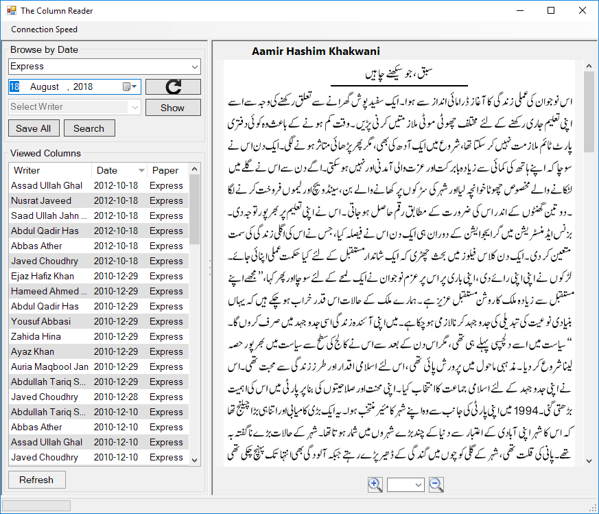

# UrduColumnsReader
Download Urdu columns in bulk from express.com.pk for offline reading

Very old project. Downloads columns from Express.com.pk, stores them by authors and dates in a structured directory. Shows a list of all downloaded columns.

Uses HtmlAgilityPack to parse the Url. Only this needs to be replaced with a library which can run JavaScript to make it working again.
